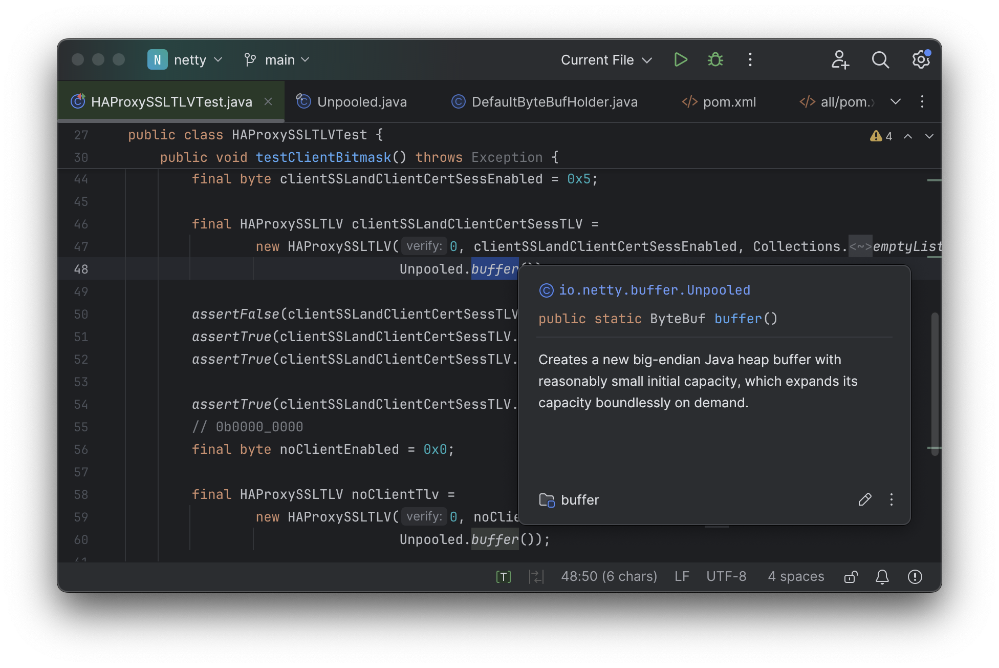
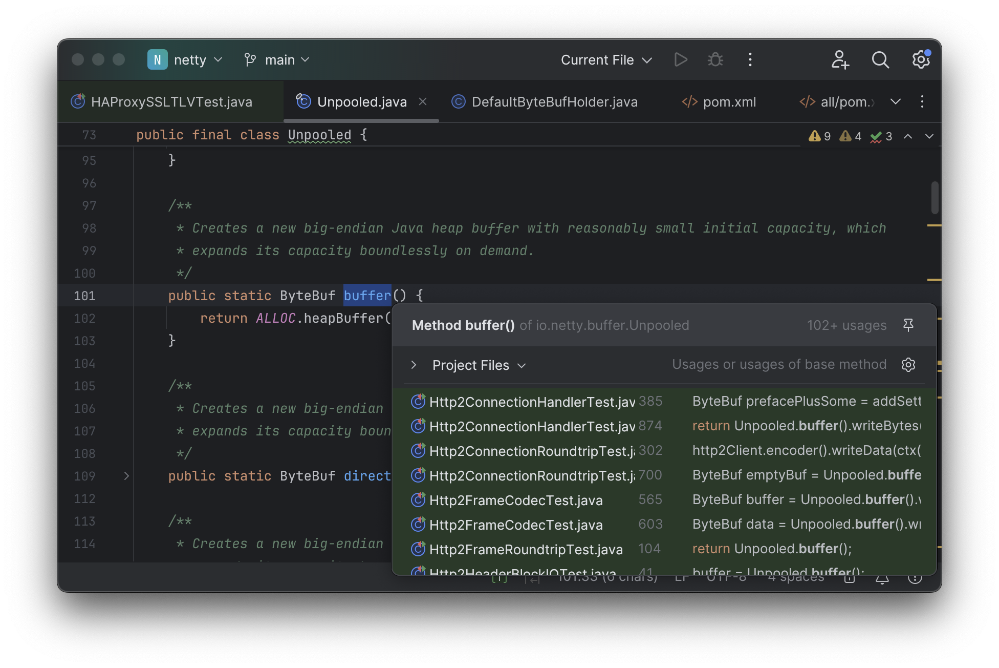
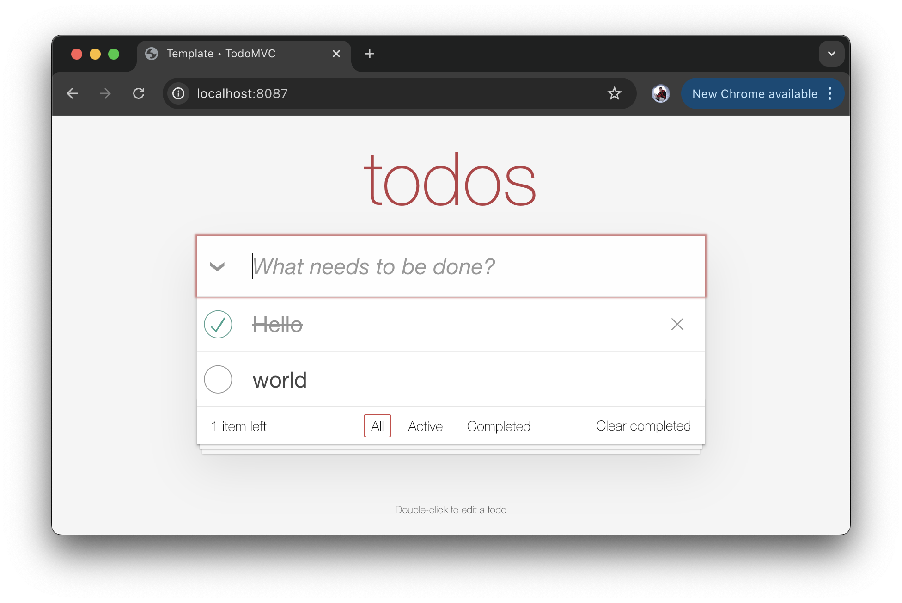
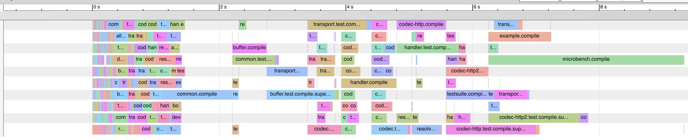

# Untapped Potential in the Java Build Tool Experience

The Java language is known to be fast, safe, and easy, but Java build tools like Maven
or Gradle don't always live up to that reputation. This article will explore what "could be":
where current Java build tools fall short in performance, extensibility, and IDE experience,
and the reasons to believe that we can do better. We will end with a demonstration of an 
experimental build tool "Mill" that makes use of these ideas, proving out the idea that Java
build tooling has the potential to be much faster, safer, and easier than it is today.

--------------------------------------------------------------------------------

## Can Java Build Tools Be Better?

Build tools like Maven and Gradle have been staples of the JVM ecosystem for decades now.
Countless developers have used these tools to build projects large and small, so they 
clearly work for the tasks they are used for. However, just because something _works_ 
doesn't mean that there isn't room to improve! There are three main areas that these 
Java build tools typically fall short:

1. IDE Experience
2. Extensibility
3. Performance

### IDE Experience

Although build tools like Maven or Gradle have support in all modern IDEs, that support
can be surprisingly thin and unhelpful. For example, consider the following snippet in 
a Maven `pom.xml` file:


If you already familiar with the various plugins involved and have already memorized how
they are configured, this snippet makes perfect sense. However, in the real world developers
are often working with partial information, and may not be familiar enough with every single
tool or plugin to be able to instantly recall how they are configured and used. That is where
IDEs are meant to come in: assisting the developer by letting them pull up the documentation
or implementation of APIs they may be unfamiliar with, so they can quickly learn what the API
does and how it can be used to accomplish their goals. 

However, if you try to use the normal IDE _"jump to definition"_ on this Maven `pom.xml` 
snippet, it brings you to this:


To be clear, this result is useful: we now know that `sources` has the type
`java.io.File[]`, it is `required`, and it is documented as `Additional source directories`.
However, the next question a developer asks is always the same: how is `sources` used
by the plugin? How do changes in `sources` end up influencing the behavior of the system,
in this case the build tool? If I as a developer need to debug an issue in the local build
or the upstream plugin, these are common questions to ask. 

In application code, you can almost always use your IDE's _jump to the definition_, 
_find usages_, or other code navigation tools to explore and understand the underlying
logic, but these tools are conspicuously absent when working with build tool config files.
As a result you often end up re-reading the documentation for the Nth time, digging through
Stackoverflow, or copy-pasting from other local examples. While this can help, it is much
more time-consuming and error-prone than being able to explore the codebase in your IDE.

This problem is not unique to Maven and it's `pom.xml`; Gradle suffers the same problem. 
For example, let's say you looked at the following code and weren't 100% sure what
`compilerArgs` does:


Again, you could probably guess what this does: it configures the compiler. But it
is still reasonable to want to learn more: 

- _Which_ compiler? Gradle supports Java, Kotlin, Scala, Swift, and other languages!
- What is the default value of this field?
- What was the value of this field before we appended the `--add-exports` flag to it?
- Does it apply to `test` code compilation? Or `javadoc` compilation?

But if you asked your IDE to jump-to-definition to try and learn more about this flag, you
will receive a screenful of de-compiled bytecode


Not only is the de-compiled code missing all javadoc and comments and other niceties, but
there is a more fundamental problem: the code is a simple _getter_ and _setter_! All you know
is that _someone_ is _setting_ this mutable variable, and _someone_ is _getting_ it, but these
could be happening anywhere in the huge Gradle codebase.

While the Gradle example above is in Groovy, the experience with Gradle Kotlin is similar.

The reason there is untapped potential here is that this is _not_ the IDE experience that
someone expects from a JVM project! If I open a random Java file in any Java project, I expect
to be able to pull up the documentation and signature of _any_ identifier in that file
with a single keypress:



And with another keypress, I expect to be able to _jump to definition_ to see where the
identifier comes from, and also _find usages_ to see where the identifier is used throughout
the program:



In a typical Java setup, this seamless _jump-to-definition_ and _find usages_ works 
throughout: your own code, third-party libraries, standard libraries, and so on. But 
somehow that experience does not translate to build tools. Can build tools do better?

### Extensibility 

All build tools are extensible to some degree: even if 99% of the time you are doing 
standard things like compiling Java sources into classfiles and packaging them into 
jars, 1% of the time you actually do need to do something custom and unusual. Let's
consider a simple requirement:

- _"Count the number of lines of code in the project and save it in a line-count.txt resource file"_

While this requirement may be contrived and arbitrary, it is representative of the many
idiosyncratic things that any real-world project needs. Custom linters, custom deployment
artifacts, custom BOM metadata, etc. are all things that real world build systems need
to support. "counting the lines and saving it" is just the "hello world" version of these
common real-world build customizations

Both Maven and Gradle can be extended to let you do this, but it is non-trivial.
For example, in Maven you may come up with:

```xml
<plugin>
    <groupId>org.codehaus.mojo</groupId>
    <artifactId>exec-maven-plugin</artifactId>
    <version>3.1.0</version>
    <executions>
        <execution>
            <id>generate-line-count</id>
            <phase>generate-resources</phase>
            <goals>
                <goal>exec</goal>
            </goals>
            <configuration>
                <executable>sh</executable>
                <arguments>
                    <argument>-c</argument>
                    <argument>
                        mkdir -p target/generated-resources &amp;&amp;
                        find src -name '*.java' | xargs wc -l > target/generated-resources/line-count.txt
                    </argument>
                </arguments>
            </configuration>
        </execution>
    </executions>
</plugin>
```

This snippet uses the `exec-maven-plugin` to count the lines of code using shell command
`find src -name '*.java' | xargs wc -l > line-count.txt` This works, but there's a lot of
subtlety and trickiness around it:

1. You have to escape the `&&` as `&amp;&amp;` in XML in order to make it parse correctly
2. `find` only works on Mac and Linux; this won't work on Windows
3. What happens if some source files live outside of `src/`, e.g. Generated source files in `target/`?

You can also implement this in Gradle, and it looks something like the following:

```groovy
import java.io.File

tasks.register("generateLineCount") {
    val sourceDirs = listOf("src/main/java")
    val outputDir = layout.buildDirectory.dir("generated-resources")
    val outputFile = outputDir.get().file("line-count.txt")

    inputs.files(fileTree("src/main"))
    outputs.file(outputFile)

    doLast {
        var totalLines = 0

        sourceDirs.map(::file).filter { it.exists() }.forEach { srcDir ->
            srcDir.walkTopDown()
                .filter { it.isFile && it.extension in listOf("java") }
                .forEach { file ->
                    totalLines += file.readLines().size
                }
        }

        outputFile.asFile.writeText(totalLines.toString())
        println("Generated line-count.txt with $totalLines lines")
    }
}

tasks.named("processResources") {
    dependsOn("generateLineCount")
    from(layout.buildDirectory.dir("generated-resources"))
}
```

This is also tricky, but for different reasons than the Maven XML version. It runs
as Kotlin on the JVM, so you don't need to worry about cross-platform support. But
there are other issues:

1. You need to remember to keep `sourceDirs` in sync with `inputs.files`. In the example
   above, the two refer to different folders, which would result in unnecessary re-running
   of this tasks if e.g. `src/main/resources/` changes

2. You need to remember to add the `dependsOn` clause in `processResources`, otherwise
   you will find `generateLineCount` not running when it should.

3. You need to make sure `src/main/java` is actually where the sources live! What if 
   it's actually `src/main/kotlin`? What about generated sources in `target/`

The above code has a bug that can cause the `line-count.txt` to be spuriously re-computed
if `.java` files not in `src/main/java` are modified. Can you spot it?

In general, the bugs in the Gradle case won't come from the line count logic.
Rather, they would come from how this piece of code integrates with the rest of Gradle:
the registration of tasks, registration of task dependencies, registration of input
files and output files, all of which are done manually and can easily fall out of sync.

What is notable about "count lines and save it to a file" requirement is that it is 
_entirely trivial_. Any first-year programming student should be able to write it,
and any professional programmer should be able to bang it out in their language 
of choice in about 30 seconds, and have it work robustly across operating systems
and in the presence of incremental builds and parallelism. But the build tools like
Maven or Gradle make this trivial task decidedly non-trivial. That's not to say it's 
_impossible_, but it's a lot harder than such a simple task should be!

### Performance

The last area to discuss here is performance. Java is a very performant language, and the
Java compiler written in Java is also very fast. But no Java build tool seems to
be able to surface that speed to the developer.

For example, consider the time taken to clean compile a single module in the 500kLOC Netty 
codebase

```bash
>  ./mvnw clean; time ./mvnw -pl common -Pfast compile
[INFO] ------------------------------------------------------------------------
[INFO] BUILD SUCCESS
[INFO] ------------------------------------------------------------------------
[INFO] Total time:  5.204 s
[INFO] Finished at: 2025-03-25T13:53:43+01:00
[INFO] ------------------------------------------------------------------------
./mvnw -pl common -Pfast compile  17.53s user 1.05s system 301% cpu 6.153 total   
```
The exact time taken will depend on hardware, OS, and Java versions. But when I ran it above
it took about ~6s to compile this `common` module, which contains ~30kLOC

```bash
> find common/src/main/java | grep \\.java | xargs wc -l
...
   29712 total
```

6s to compile 30kLOC works out to be about ~5k lines per second. If we do another benchmark
and try to compile the entire 500kLOC codebase, it takes about ~100s to compile on a single core:

```bash
> ./mvnw clean; time ./mvnw -Pfast  -Dcheckstyle.skip -Denforcer.skip=true -DskipTests install
222.12s user 19.51s system 245% cpu 1:38.53 total
```

Again, we are looking at Maven compile ~5k lines of Java code per second. These numbers are
with all dependencies already downloaded, with the `~/.m2` cache already populated, and with
all linters and tests disabled via `-DskipTests` and `-Pfast`. We just want to look at 
compilation speeds.

In isolation that number seems fine: ~6s to compile a single moderately-sized module, ~100s
to compile the entire project (this drops to ~50s if we parallelize it with `-T10`). But it's
worth asking: how fast _should_ Java code compile?

It turns out, Java compiles a lot faster than 5kLOC per second! If we go back to the `common`
module we looked at earlier, and try compiling it directly with `javac` rather than going
through `./mvnw`, it compiles in ~1.5s instead of ~6s, which gives ~20kLOC per second:

```bash
> time javac -d out/test \
    -cp /Users/lihaoyi/Github/netty/common/target/classes:/Users/lihaoyi/.m2/repository/org/graalvm/nativeimage/svm/19.3.6/svm-19.3.6.jar:/Users/lihaoyi/.m2/repository/org/graalvm/sdk/graal-sdk/19.3.6/graal-sdk-19.3.6.jar:/Users/lihaoyi/.m2/repository/org/graalvm/nativeimage/objectfile/19.3.6/objectfile-19.3.6.jar:/Users/lihaoyi/.m2/repository/org/graalvm/nativeimage/pointsto/19.3.6/pointsto-19.3.6.jar:/Users/lihaoyi/.m2/repository/org/graalvm/truffle/truffle-nfi/19.3.6/truffle-nfi-19.3.6.jar:/Users/lihaoyi/.m2/repository/org/graalvm/truffle/truffle-api/19.3.6/truffle-api-19.3.6.jar:/Users/lihaoyi/.m2/repository/org/graalvm/compiler/compiler/19.3.6/compiler-19.3.6.jar:/Users/lihaoyi/.m2/repository/org/jctools/jctools-core/4.0.5/jctools-core-4.0.5.jar:/Users/lihaoyi/.m2/repository/org/jetbrains/annotations-java5/23.0.0/annotations-java5-23.0.0.jar:/Users/lihaoyi/.m2/repository/org/slf4j/slf4j-api/1.7.30/slf4j-api-1.7.30.jar:/Users/lihaoyi/.m2/repository/commons-logging/commons-logging/1.2/commons-logging-1.2.jar:/Users/lihaoyi/.m2/repository/org/apache/logging/log4j/log4j-1.2-api/2.17.2/log4j-1.2-api-2.17.2.jar:/Users/lihaoyi/.m2/repository/org/apache/logging/log4j/log4j-api/2.17.2/log4j-api-2.17.2.jar:/Users/lihaoyi/.m2/repository/io/projectreactor/tools/blockhound/1.0.6.RELEASE/blockhound-1.0.6.RELEASE.jar \
    common/src/main/java/**/*.java
5.75s user 0.25s system 406% cpu 1.476 total
```

Above we are calling `javac` and passing in the (rather long) classpath along with a source
file glob to the `javac` command line tool. This does effectively the same thing that Maven
does internally, but it does it without Maven, and we are seeing a ~4x speedup as a result.
This suggests that 3/4 of the time Maven spends on a `./mvnw compile` is actually just build 
tool overhead unrelated to the compilation itself.

But that's not all: `javac` is a Java program, and any experienced Java developer knows that
running a Java program "cold" from the command line gets you the _worst_ possible performance
out of it. Java programs should be kept warm in-memory in a long-lived process so the JVM
has time to JIT-compile and optimize the bytecode. If `javac` run cold from the commandline
can compile Java at ~20kLOC/s, we would expect `javac` kept warm in a long-lived process to be
much faster.

To test this, we can run `javac` in-memory using its `javax.tools.*` API that is available
with most recent versions of the JDK. The `Bench.java` file below simply runs this over and over in a `while`
loop and prints out the time taken:

```java
// Bench.java
import javax.tools.*;
import java.io.IOException;
import java.io.OutputStreamWriter;
import java.nio.file.*;
import java.util.List;
import java.util.stream.Collectors;

public class Bench {
    public static void main(String[] args) throws Exception {
        String classpath = args[0];
        Path sourceFolder = Paths.get(args[1]);
        long lineCount = Files.walk(sourceFolder)
                .filter(p -> p.toString().endsWith(".java"))
                .map(p -> {
                    try { return Files.readAllLines(p).size(); }
                    catch(Exception e){ throw new RuntimeException(e); }
                })
                .reduce(0, (x, y) -> x + y);

        while (true) {
            List<JavaFileObject> files = Files.walk(sourceFolder)
                    .filter(p -> p.toString().endsWith(".java"))
                    .map(p ->
                            new SimpleJavaFileObject(p.toUri(), JavaFileObject.Kind.SOURCE) {
                                public CharSequence getCharContent(boolean ignoreEncodingErrors) throws IOException {
                                    return Files.readString(p);
                                }
                            }
                    )
                    .collect(Collectors.toList());

            long now = System.currentTimeMillis();

            JavaCompiler compiler = ToolProvider.getSystemJavaCompiler();

            StandardJavaFileManager fileManager = compiler
                    .getStandardFileManager(null, null, null);

            // Run the compiler
            JavaCompiler.CompilationTask task = compiler.getTask(
                    new OutputStreamWriter(System.out),
                    fileManager,
                    null,
                    List.of("-classpath", classpath, "-d", "target/bench"),
                    null,
                    files
            );

            System.out.println("Compile Result: " + task.call());
            long end = System.currentTimeMillis();

            System.out.println("Lines: " + lineCount);
            System.out.println("Duration: " + (end - now));
            System.out.println("Lines/second: " + (int)(lineCount / ((end - now) / 1000.0)));
        }
    }
}
```

This can be run as follows:

```bash
> java Bench.java \
  /Users/lihaoyi/Github/netty/common/target/classes:/Users/lihaoyi/.m2/repository/org/graalvm/nativeimage/svm/19.3.6/svm-19.3.6.jar:/Users/lihaoyi/.m2/repository/org/graalvm/sdk/graal-sdk/19.3.6/graal-sdk-19.3.6.jar:/Users/lihaoyi/.m2/repository/org/graalvm/nativeimage/objectfile/19.3.6/objectfile-19.3.6.jar:/Users/lihaoyi/.m2/repository/org/graalvm/nativeimage/pointsto/19.3.6/pointsto-19.3.6.jar:/Users/lihaoyi/.m2/repository/org/graalvm/truffle/truffle-nfi/19.3.6/truffle-nfi-19.3.6.jar:/Users/lihaoyi/.m2/repository/org/graalvm/truffle/truffle-api/19.3.6/truffle-api-19.3.6.jar:/Users/lihaoyi/.m2/repository/org/graalvm/compiler/compiler/19.3.6/compiler-19.3.6.jar:/Users/lihaoyi/.m2/repository/org/jctools/jctools-core/4.0.5/jctools-core-4.0.5.jar:/Users/lihaoyi/.m2/repository/org/jetbrains/annotations-java5/23.0.0/annotations-java5-23.0.0.jar:/Users/lihaoyi/.m2/repository/org/slf4j/slf4j-api/1.7.30/slf4j-api-1.7.30.jar:/Users/lihaoyi/.m2/repository/commons-logging/commons-logging/1.2/commons-logging-1.2.jar:/Users/lihaoyi/.m2/repository/org/apache/logging/log4j/log4j-1.2-api/2.17.2/log4j-1.2-api-2.17.2.jar:/Users/lihaoyi/.m2/repository/org/apache/logging/log4j/log4j-api/2.17.2/log4j-api-2.17.2.jar:/Users/lihaoyi/.m2/repository/io/projectreactor/tools/blockhound/1.0.6.RELEASE/blockhound-1.0.6.RELEASE.jar \
  common/src/main/java
```

If you do this, you will find it start of slow but gradually speed up over time. Running this for
about ~30s on my laptop results in the following output near the end:

```

Lines: 29712
Duration: 251
Lines/second: 118374

Lines: 29712
Duration: 253
Lines/second: 117438
```

So while Maven compiles Java code at ~5kLOC/s, and `javac` run from the command line compiles
at ~20kLOC/s, `javac` run in-memory and allowed to get hot compiles at almost ~120kLOC/s!

If we repeat this exercise with Gradle, using the Mockito codebase as an example, we get 
similar results, which I tabulated below

| Mockito Core | Time | Compiler lines/s | Slowdown | Netty Common | Time | Compiler lines/s | Slowdown |
|--------------|------|------------------|----------|--------------|------|------------------|----------|
| Javac Hot | 0.36s | 115,600 | 1.0x | Javac Hot | 0.29s | 117,500 | 1.0x |
| Javac Cold | 1.29s | 32,200 | 4.4x | Javac Cold | 1.48s | 20,100 | 5.1x |
| Gradle | 4.41s | 9,400 | 15.2x | Maven | 4.89s | 4,800 | 21.2x |

So Maven and Gradle actually compile Java code 15-20x slower than `javac` itself is able
to do so! While Netty's ~500kLOC compiles in ~100s with Maven, it _should_ compile in 4-5s
if compiled using Javac directly. Java compiles _should_ be basically instant even for large
codebases like Netty, but build tools like Maven or Gradle add enough overhead that you can
really feel the slowness.


## The Mill Build Tool

Mill is a fast, scalable, multi-language build tool that supports Java, Scala, Kotlin. 
At its core, it does many of the same things as Maven or Gradle. You define a `build.mill`
file (using Scala, rather than Groovy or Kotlin as Gradle does):


```scala
// build.mill
package build
import mill._, javalib._

object foo extends JavaModule {
  def ivyDeps = Agg(
    ivy"net.sourceforge.argparse4j:argparse4j:0.9.0",
    ivy"org.thymeleaf:thymeleaf:3.1.1.RELEASE"
  )

  object test extends JavaTests with TestModule.Junit4
}
```

And you can use this build file to compile, test, run, and generate assemblies of your
project:

```bash
> ./mill foo.compile
compiling 1 Java source...

> ./mill foo.run --text hello
<h1>hello</h1>

> ./mill foo.test
Test foo.FooTest.testEscaping finished, ...
Test foo.FooTest.testSimple finished, ...
0 failed, 0 ignored, 2 total, ...

> ./mill show foo.assembly
".../out/foo/assembly.dest/out.jar"

> ./out/foo/assembly.dest/out.jar --text hello
<h1>hello</h1>
```

Mill can build any Java application if configured with the appropriate dependencies.
For example, the following `build.mill` configures a Spring-Boot TodoMVC application
with all bells and whistles: `data-jpa`, `thymeleaf`, `validation`, `jaxb-api`, 
`webjars` for the CSS and Javascriptc, as well as unit in-memory tests using H2
and integration tests using Dockerized Postgres in TestContainers:

```scala
// build.mill
package build
import mill._, javalib._

object `package` extends RootModule with JavaModule {
  def ivyDeps = Agg(
    ivy"org.springframework.boot:spring-boot-starter-data-jpa:2.5.4",
    ivy"org.springframework.boot:spring-boot-starter-thymeleaf:2.5.4",
    ivy"org.springframework.boot:spring-boot-starter-validation:2.5.4",
    ivy"org.springframework.boot:spring-boot-starter-web:2.5.4",
    ivy"javax.xml.bind:jaxb-api:2.3.1",
    ivy"org.webjars:webjars-locator:0.41",
    ivy"org.webjars.npm:todomvc-common:1.0.5",
    ivy"org.webjars.npm:todomvc-app-css:2.4.1"
  )

  trait CommonTestModule extends JavaTests with TestModule.Junit5 {
    def mainClass = Some("com.example.TodomvcApplication")
    def ivyDeps = super.ivyDeps() ++ Agg(
      ivy"org.springframework.boot:spring-boot-starter-test:2.5.6"
    )
  }
  object test extends CommonTestModule {
    def ivyDeps = super.ivyDeps() ++ Agg(
      ivy"com.h2database:h2:2.3.230"
    )
  }
  object integration extends CommonTestModule {
    def ivyDeps = super.ivyDeps() ++ Agg(
      ivy"org.testcontainers:testcontainers:1.18.0",
      ivy"org.testcontainers:junit-jupiter:1.18.0",
      ivy"org.testcontainers:postgresql:1.18.0",
      ivy"org.postgresql:postgresql:42.6.0"
    )
  }
}
```

This can be run locally from the command line:

```bash
> mill test
...com.example.TodomvcTests#homePageLoads() finished...
...com.example.TodomvcTests#addNewTodoItem() finished...

> mill integration
...com.example.TodomvcIntegrationTests#homePageLoads() finished...
...com.example.TodomvcIntegrationTests#addNewTodoItem() finished...

> mill test.runBackground

> curl http://localhost:8087
...<h1>todos</h1>...

> mill clean runBackground
```

Or interacted with in the browser:



So far, nothing we have seen here is unusual: these are just things that any Maven
or Gradle project can do. So what value does Mill provide as a build tool?

## How Mill Improves Upon the Java Build Tool Experience

To look at how Mill improves upon things, we will consider the same three areas we 
looked at earlier: IDE experience, extensibility, and performance:

### IDE Experience

In terms of IDE experience, Mill has support in IDEs like IntelliJ or VSCode
like Maven or Gradle do, but that support turns out to be much more useful. 

Earlier, we looked a Maven build that configures some generated sources, and 
saw how the IDE experience of exploring the configuration was shallow: it told
us what types things were, but not how these configuration values were actually used.
Mill's experience is different: for example, consider the following custom task that
creates some generated sources:


Right off the bat, you can mouse over the task and see the documentation inherited from 
the overridden task. If you want to learn more, you can jump to definition to see where
the overridden task is defined:


From there, you can see how this `generatedSources` task ends up being used in `allSources`,
`allSourceFiles`, and finally in `compile`:


The Mill build logic is no simpler than Maven or Gradle: it still needs to process the input
configuration to decide how to correctly build your project. Where Mill differs is that the
build logic is navigate-able in your IDE: you can see how these configuration values, files,
and tasks combine together to produce the output artifacts you want. While in the example
above we stopped after seeing how `def generatedSources` feeds into `def compile`, we can
continue to explore the build logic arbitrarily deeply if we desired: looking at the 
implementation of `.findSourceFiles`, `.compileJava`, and so on.

This IDE experience is not new: it is what Java developers everywhere are experiencing every
day working on their application code! But Mill is able to bring this IDE experience to
your build tool in a way that other build tools like Maven or Gradle cannot, which greatly
helps anyone who is trying to debug issues with their build and understand why it is acting
the way it does.

### Extensibility

Most build tools require extensions to be written as plugins: you end up assembling
a collection of plugins off of Github of varying quality, maintenance, and fit, and
trying to coerce those plugins into doing what you want. Mill is different in that
it allows you to just _write code_ and _use any Java library from Maven Central_
to configure your build and do what you want.

In Mill, customizing a module to add a generated `line-count.txt` resource file looks 
like this:

```scala
object foo extends JavaModule {
  /** Total number of lines in module source files */
  def lineCount = Task {
    allSourceFiles().map(f => os.read.lines(f.path).size).sum
  }

  /** Generate resources using lineCount of sources */
  override def resources = Task {
    os.write(Task.dest / "line-count.txt", "" + lineCount())
    super.resources() ++ Seq(PathRef(Task.dest))
  }
}
```

One method `def` to compute the line count, another `override def` to replace resources, 
and that's it. We see the same the business logic here as in the Gradle/Kotlin example 
earlier, perhaps slightly simplified (the `allSourceFiles()` method already handles
the recursive listing of `.java` files for us so we don't need to repeat it here). 

What's notable here is what we _don't_ see here: `doLast`, `dependsOn`, `inputs.files`,
`outputs.files`, hard-coded references to paths like `"src/main/java"`. With Mill, you 
just write the business logic of what your build tasks need to do: `def lineCount` reads the
lines of each file and sums them up, `override def resources` writes out the `line-count.txt`
file and adds a path reference to it to the resource path. All the manual work done in Gradle 
to register task dependencies, register input-output files, decide when the task will run,
etc. is all done automatically for you in Mill.

Mill even allows you to use any third-party JVM library from Maven Central as part of your
build config. For example, let's say we had a new requirement that the `line-count.txt` should
be rendered as a HTML string. Mill as a build tool does not come with HTML templating libraries
built in, but it makes it very easy to import such libraries using the `import $ivy` syntax:

```scala
package build
import mill._, javalib._
import $ivy.`org.thymeleaf:thymeleaf:3.1.1.RELEASE`
import org.thymeleaf.TemplateEngine
import org.thymeleaf.context.Context
object foo extends JavaModule {
   def lineCount = Task {
      allSourceFiles().map(f => os.read.lines(f.path).size).sum
   }

   def htmlSnippet = Task {
    val context = new Context()
    context.setVariable("lineCount", "" + lineCount())
    new TemplateEngine().process("<h1 th:text=\"${lineCount}\"></h1>", context)
  }

  def resources = Task.Sources{
    os.write(Task.dest / "snippet.txt", htmlSnippet())
    super.resources() ++ Seq(PathRef(Task.dest))
  }
}
```

In this snippet, we `import $ivy` the `org.thymeleaf` library, which immediately makes
it available in our build config. We can then directly `import org.thymeleaf.TemplateEngine`
and `org.thymeleaf.context.Context` and use it just as we would use it in any Java application.
In this example, we are using it to pre-render a `<h1>{lineCount}</h1>` html snippet in 
`line-count.txt` for our application to use at runtime.

What's interesting about this example is that there are no plugins here: there is no
`mill-thymeleaf-plugin` to integrate HTML rendering into your build pipeline, there is 
no `mill-linecount-plugin` to count the lines of code, there is no `mill-generated-resources`
plugin to generate resource files that can be read at runtime. Instead, Mill lets you 
directly write code to do exactly what you want, using the common open source Java 
libraries you already know how to use. This democratizes your build so that any Java
developer can configure it, rather than being limited to those that hold the title
of "build tool expert" or "plugin author".

### Performance

Mill can compile the same Java module much faster than Maven or Gradle. For example,
we can compile the Netty `common` module we discussed earlier via

```bash
> ./mill clean common; time ./mill common.compile
0.02s user 0.05s system 6% cpu 1.114 total      
```

Or compile the entire 500kLOC Netty codebase on a single thread via

```bash
> ./mill clean && time ./mill -j1 __.compile
0.25s user 0.79s system 4% cpu 22.782 total
```

Below we extend the table we saw earlier, and repeat the Mill measurements
on the same Mockito codebase we used to test Gradle. we can see that although 
Mill only matches the performance of `Javac Cold`, and still has significant
overhead over `Javac Hot`, it is able to compile the same code much faster than 
Maven or Gradle:

| Mockito Core | Time | Compiler lines/s | Slowdown | Netty Common | Time | Compiler lines/s | Slowdown |
|--------------|------|------------------|----------|--------------|------|------------------|----------|
| Javac Hot | 0.36s | 115,600 | 1.0x | Javac Hot | 0.29s | 117,500 | 1.0x |
| Javac Cold | 1.29s | 32,200 | 4.4x | Javac Cold | 1.48s | 20,100 | 5.1x |
| Gradle | 4.41s | 9,400 | 15.2x | Maven | 4.89s | 4,800 | 21.2x |
| *Mill* | *1.20s* | *34,700* | *4.1x* | *Mill* | *1.11s* | *26,800* | *3.8x* |

Mill compiling the entire Netty codebase in ~23s on a single thread still does not 
live up to the ~4-5s that extrapolating our single-module benchmarks would suggests,
but is a significant ~4x improvement over Maven compiling the codebase in ~100s 
on a single core!

If we benchmark a variety of scenarios, we see that the speedup is pretty consistent
regardless of whether you run on a single-thread or in parallel, whether you compile
the entire codebase or just a single module, and whether you do clean or incremental
compiles. In fact, Mill's performance stands out even more for incremental compiles,
where it is able to compile and return in ~0.2s where Gradle takes >1s and Maven several 
seconds!

| Benchmark | Maven | Mill | Speedup |
|-----------|-------|------|---------|
| [Sequential Clean Compile All](https://mill-build.org/mill/main-branch/comparisons/maven.html#_sequential_clean_compile_all) | 98.80s | 23.41s | 4.2x |
| [Parallel Clean Compile All](https://mill-build.org/mill/main-branch/comparisons/maven.html#_parallel_clean_compile_all) | 48.92s | 9.29s | 5.3x |
| [Clean Compile Single Module](https://mill-build.org/mill/main-branch/comparisons/maven.html#_clean_compile_single_module) | 4.89s | 0.88s | 5.6x |
| [Incremental Compile Single Module](https://mill-build.org/mill/main-branch/comparisons/maven.html#_incremental_compile_single_module) | 6.82s | 0.18s | 37.9x |
| [No-Op Compile Single Module](https://mill-build.org/mill/main-branch/comparisons/maven.html#_no_op_compile_single_module) | 5.25s | 0.12s  | 43.8x |

| Benchmark | Gradle | Mill | Speedup |
|-----------|--------|------|---------|
| [Sequential Clean Compile All](https://mill-build.org/mill/main-branch/comparisons/gradle.html#_sequential_clean_compile_all) | 17.6s | 5.86s | 3.0x |
| [Parallel Clean Compile All](https://mill-build.org/mill/main-branch/comparisons/gradle.html#_parallel_clean_compile_all) | 12.3s | 3.75s | 3.3x |
| [Clean Compile Single Module](https://mill-build.org/mill/main-branch/comparisons/gradle.html#_clean_compile_single_module) | 4.41s | 1.30s | 3.4x |
| [Incremental Compile Single Module](https://mill-build.org/mill/main-branch/comparisons/gradle.html#_incremental_compile_single_module) | 1.37s | 0.20s | 6.9x |
| [No-Op Compile Single Module](https://mill-build.org/mill/main-branch/comparisons/gradle.html#_no_op_compile_single_module) | 0.94s | 0.11s | 8.5x |

Compilation speed is just one aspect of a build tool's performance, and while it may 
be the easiest to measure, it is by no means the most important. Mill

- *--watch and re-run*: automatically re-run tests or services when code changes, 
  saving time having to manually click the "run" button or tab back to your terminal
  to repeat a command

- *Parallel Testing*: this lets you use all cores on your machine to speed up testing,
  which makes an enormous difference in today's multi-core world

- *Selective Test Execution*: speeds up CI by only running tests affected by code being
  changed. This can cut hour-long PR validation down to minutes by skipping unrelated tests

- *Incremental Assembly Jar Creation*: cuts down the creation of large assembly jars 
  from 20s to 1s, which really speeds up workflows that use them (e.g. manual testing,
  or `spark-submit`)

- *Automatic Parallel Profile Generation*: mill automatically generates profile files
  for every command, that you can load into your `chrome://tracing` profiler included in
  any chrome browser to visualize where the time in your build is being spent



## Conclusion

In this article, we have looked at the ways in which Java build tools like Maven and 
Gradle fall short of Java's reputation as a performant and easy-to-use language with 
great IDE support. While the performance, usability, and IDE integrations with these
build tools are _usable_, they are not _great_, and are far from what you
would expect working within the application code of any Java codebase.

We then discussed the Mill build tool and how it is able to improve upon the shortcomings
of tools like Maven or Gradle: 3-6x faster compiles, easier extensibility, and an IDE 
experience that allows you to navigate your build logic just as easily as any application
code. While there is still room to improve, it nevertheless shows a significant step up
from tools like Maven or Gradle.

JVM build tools definitely have a lot of room to improve. While Mill takes some baby steps
in that direction, there's a lot more work to be done to give Java developers a
build tool experience worthy of the platform it runs on.